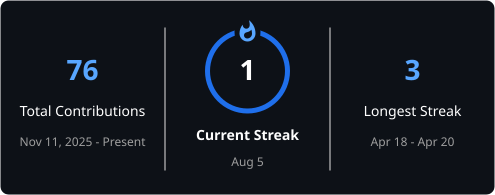

<h1 align="center">Jotinder Bhamra</h1>

  <strong>Computer Science + Statistics @ the University of Auckland</strong>

  Building practical software at the intersection of <strong>engineering, data, AI, and thoughtful product design</strong>.

  
  

---

## About me

- First-year BSc student majoring in **Computer Science and Statistics** at the University of Auckland.
- Interested in **software engineering, data science, and applied AI**.
- **Two-time second-place hackathon finisher** in 2026.
- **Outreach Officer at UOACS**, helping connect students, industry, and the wider technology community.
- I enjoy turning ambitious ideas into working prototypes, especially through collaborative and fast-paced projects.

## Selected work

<table>
  <tr>
    <td width="50%" valign="top">
      <h3>🌍 Map to the Future</h3>
      

        A climate-risk exploration platform built in three days for the
        UOACS × DEVS Hackathon, where our team placed <strong>2nd out of 14 teams</strong>.
      

      

        Explore future climate, population, and building-cost scenarios through
        an interactive 3D globe, comparison tools, generated reports, and an AI assistant.
      

      
<strong>React · TypeScript · Vite · Tailwind CSS · CesiumJS · OpenAI API</strong>

      <a href="https://github.com/JotinderBhamra/UOACSxDEVS-Hackathon"><strong>View repository →</strong></a>
    </td>
    <td width="50%" valign="top">
      <h3>🪐 Interplanetary Booking</h3>
      

        A safety-oriented planetary booking platform created for the
        DEVS × SESA Beginner Hackathon, earning another <strong>second-place finish</strong>.
      

      

        I helped develop the planet experience, including environmental information
        and compatibility-focused browsing for different species.
      

      
<strong>React · TypeScript · Vite · CSS</strong>

      <a href="https://github.com/JotinderBhamra/devs-sesa-beginner-hackathon-2026-ballmer-peak"><strong>View repository →</strong></a>
    </td>
  </tr>
</table>

## Technologies

  
  
  
  
  
  
  
  
  
  
  

## Current focus

- Strengthening my foundations in **algorithms, discrete mathematics, statistics, and software design**.
- Building more complete applications with **React, TypeScript, testing, APIs, and deployment**.
- Exploring how **AI and data** can support useful, reliable products rather than exist as standalone features.
- Preparing for future opportunities in **software engineering, data, and AI/ML**.

## GitHub activity

  
  

  

<picture>
  <source media="(prefers-color-scheme: dark)" srcset="./profile/github-snake-dark.svg" />
  <source media="(prefers-color-scheme: light)" srcset="./profile/github-snake.svg" />
  
</picture>

---

  <a href="https://jotinderbhamra.github.io/">Portfolio</a>
  ·
  <a href="https://www.linkedin.com/in/jotinderbhamra">LinkedIn</a>
  ·
  <a href="https://github.com/JotinderBhamra?tab=repositories">Repositories</a>

